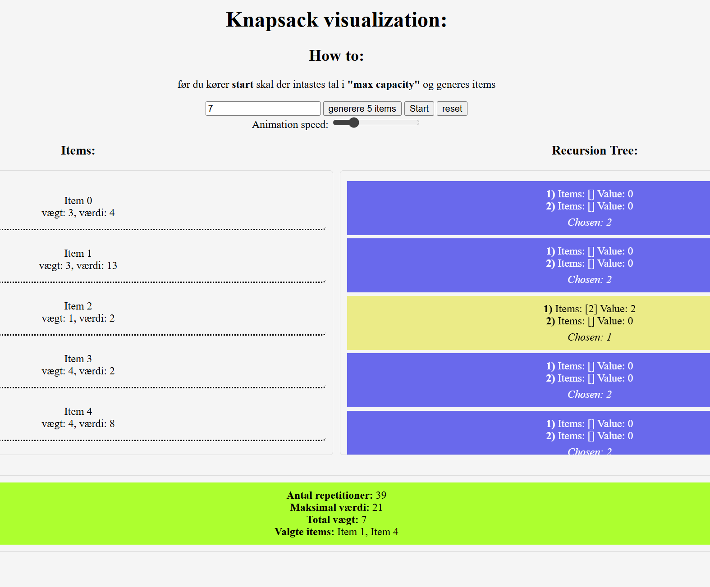

# Knapsack Problem 01
  Knapsack-problemet handler om at vælge genstande til en rygsæk, når der ikke er plads til alt. Hver genstand har både en vægt og en værdi, og opgaven er at finde den kombination af genstande, som giver den højeste samlede værdi uden at overskride rygsækkens kapacitet.

  Denne algoritme gennemgår forskellige kombinationer af genstande for at finde den bedste løsning. Den anvender "Branch and Bound"-teknikken, som systematisk opdeler problemet ved at teste forskellige muligheder og udelukke de dårligste løsninger tidligt. Dette adskiller sig fra "Divide and Conquer"-metoder (som fx mergesort), der deler input i mindre dele.

  der findes 2 andre verisoner af knapsack problem:
  Unbounded Knapsack og Double Knapsack.

  de er beskrevet i bunden.


## Big O-notation for 0/1 Knapsack-problemet

  Algoritmen skal gennemgå alle mulige kombinationer af genstande, hvilket giver en eksponentiel tidskompleksitet uden memoization, men man kan lave en version med Med rekursion + memoization og får en bigO af: O(n × W). eller bruge gøre det via Dynamic Programming (iterativt).

  #### Tidskompleksitet: O(2^n)
  - Med 5 elementer: ~32 operationer
  - Med 10 elementer: ~1.024 operationer

  #### Rumkompleksitet: O(n)
  - Hvert funktionskald bruger O(1) plads
  - Funktionen skal kaldes n gange, hvor n er dybden af stakken

  Rekursiv løsning bruger mindre plads end iterative løsninger, men køre langsommere. Den sparede tid i den iterative tilgang opnås ved at bruge mere hukommelse til at gemme mellemresultater.


## Sceenshot af visualisering:



## Gruppe:
Rolf lundsgaard Josephsen
  
## Links til Repo og deployed version:
1) https://github.com/mrPrimeBeef/Knapsack-problem
2) https://mrprimebeef.github.io/Knapsack-problem/

- README.md må også indeholde informationer om de anvendte algoritmer og datastrukturer, og beskrivelser af hvordan man kan køre visualiseringen lokalt.


## miscellaneous:

### materialer:
1) https://www.geeksforgeeks.org/dsa/0-1-knapsack-problem-dp-10/
2) https://www.geeksforgeeks.org/dsadouble-knapsack-dynamic-programming/
3) https://www.geeksforgeeks.org/dsa/unbounded-knapsack-repetition-items-allowed/
4) https://www.youtube.com/watch?v=cJ21moQpofY&t=585s
5) https://compgeek.co.in/branch-and-bound-algorithm/


#### Tests
For at køre tests skal man installere Mocha test-frameworket.

1) Installer Mocha som development dependency:
```
   npm install --save-dev mocha
```
   (`--save-dev` betyder det kun bruges under udvikling, ikke i produktion)

2) Kør tests med kommandoen:
```
   npm test
```
   `-b` flagget betyder "bail" – testen stopper efter første fejl

**package.json konfiguration:**
```json
{
  "type": "module",
  "scripts": {
    "test": "mocha test.js -b"
  },
  "devDependencies": {
    "mocha": "^11.7.5"
  }
}
```

### alternativer knapsack:
**Unbounded Knapsack**: Du kan bruge hver genstand ubegrænset mange gange. Hvis du har en genstand værd 5 point og vægt 2, kan du putte den i rygsækken 10 gange hvis der er plads. Det er nyttigt når du fx skal fylde en rygsæk med mønter af forskellige værdier.

**Double Knapsack** (0/1 Knapsack med 2 genstande af hver type): Du har præcis to kopier af hver genstand. Du kan enten ikke bruge den, bruge en eller bruge begge. Dette ligger mellem det klassiske 0/1 Knapsack (hvor du kun kan bruge hver genstand én gang) og Unbounded Knapsack.

 